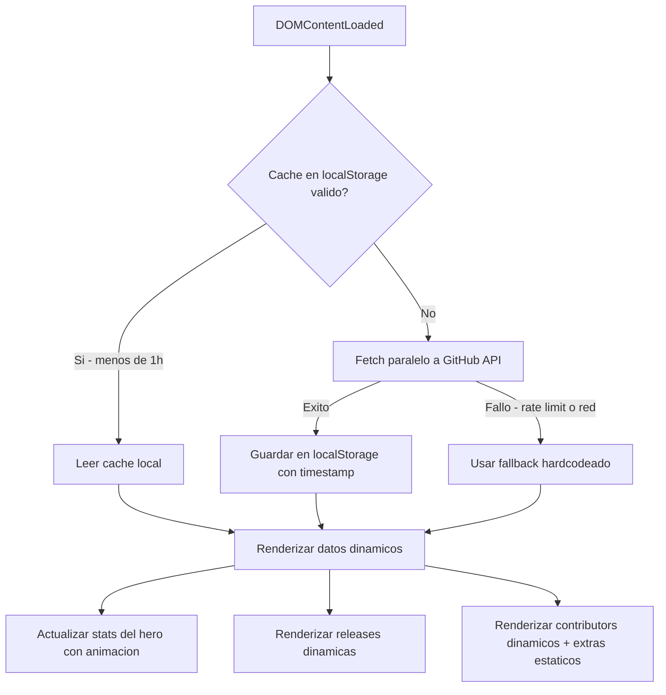
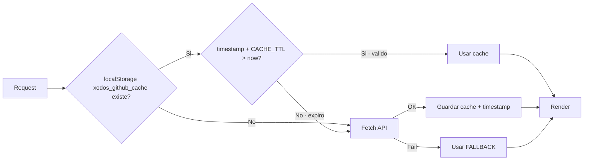

# Plan: Datos Dinámicos desde GitHub API

## Objetivo
Reemplazar todos los datos hardcodeados en la landing page de XoDos con datos reales obtenidos dinámicamente desde la GitHub API del repositorio `xodiosx/XoDos`.

---

## Datos a Dinamizar

| Sección | Dato Actual | Fuente API |
|---------|-------------|------------|
| Hero Stats | Stars: 644 | `GET /repos/xodiosx/XoDos` → `stargazers_count` |
| Hero Stats | Downloads: 300,000 | Calculado sumando `assets[].download_count` de todas las releases |
| Hero Stats | Forks: 52 | `GET /repos/xodiosx/XoDos` → `forks_count` |
| Hero Stats | Countries: 7 | ⚠️ Se mantiene estático (no hay API para esto) |
| Releases | 4 releases hardcodeadas | `GET /repos/xodiosx/XoDos/releases?per_page=5` |
| Contributors | 8 cards hardcodeadas | `GET /repos/xodiosx/XoDos/contributors?per_page=30` |

---

## Arquitectura



---

## Endpoints de GitHub API

| Endpoint | Datos obtenidos | Rate limit usage |
|----------|----------------|-----------------|
| `https://api.github.com/repos/xodiosx/XoDos` | stars, forks, watchers, open_issues | 1 request |
| `https://api.github.com/repos/xodiosx/XoDos/releases?per_page=5` | releases con assets y download_count | 1 request |
| `https://api.github.com/repos/xodiosx/XoDos/contributors?per_page=30` | contributors con avatar, contributions | 1 request |

**Total: 3 requests por carga** (solo cuando el cache expira)

---

## Archivos a Crear/Modificar

### 1. NUEVO: `js/github-api.js`

Modulo independiente con la clase `XoDosAPI`:

```javascript
const XoDosAPI = {
  REPO: 'xodiosx/XoDos',
  API_BASE: 'https://api.github.com',
  CACHE_KEY: 'xodos_github_cache',
  CACHE_TTL: 3600000, // 1 hora en ms

  // Fallback data si la API falla
  FALLBACK: {
    stars: 644,
    forks: 52,
    downloads: 300000,
    releases: [...],  // releases actuales hardcodeadas
    contributors: [...] // contributors actuales hardcodeados
  },

  // Metodos principales
  async init()           // Orquesta fetch + cache + fallback
  async fetchRepoData()  // GET /repos/xodiosx/XoDos
  async fetchReleases()  // GET /repos/xodiosx/XoDos/releases
  async fetchContributors() // GET /repos/xodiosx/XoDos/contributors
  getCachedData()        // Lee localStorage si no expiro
  setCachedData(data)    // Guarda en localStorage con timestamp
  getTotalDownloads(releases) // Suma assets[].download_count
}
```

### 2. MODIFICAR: `index.html`

Cambios especificos:

**Stats del Hero** (lineas 74-90):
- Agregar IDs unicos a cada stat-num: `id="statStars"`, `id="statDownloads"`, `id="statForks"`
- Mantener `data-count` como fallback inicial

**Releases** (lineas 271-314):
- Reemplazar las 4 release cards hardcodeadas con un contenedor vacio:
  ```html
  <div class="releases-list" id="releasesList">
    <!-- Se llena dinamicamente desde GitHub API -->
  </div>
  ```

**Contributors** (lineas 332-417):
- Reemplazar las 8 contributor cards con un contenedor + extras estaticos:
  ```html
  <div class="contributors-grid" id="contributorsGrid">
    <!-- Contributors dinamicos desde GitHub API -->
  </div>
  <!-- Contributors sin cuenta de GitHub verificable -->
  <div class="contributors-extras" id="contributorsExtras">
    <!-- Aurora0y, Chest1902, xl_v6/ashen -->
  </div>
  ```

**Script tag** (antes de main.js):
```html
<script src="js/github-api.js"></script>
<script src="js/main.js"></script>
```

### 3. MODIFICAR: `js/main.js`

Cambios especificos:

**Contador animado** (lineas 96-150):
- Modificar `animateCounters()` para leer valores desde `window.xodosData` si existe
- Si no existe (API fallo), usar `data-count` como antes

**Nuevo flujo de inicializacion**:
```javascript
// Al inicio del DOMContentLoaded:
XoDosAPI.init().then(data => {
  window.xodosData = data;
  updateHeroStats(data);
  renderReleases(data.releases);
  renderContributors(data.contributors);
  animateCounters(); // Ahora usa datos reales
});
```

**Nuevas funciones**:
- `updateHeroStats(data)` — Setea data-count en los stat-num elements
- `renderReleases(releases)` — Genera HTML para cada release card
- `renderContributors(contributors)` — Genera HTML para cada contributor card
- `formatNumber(num)` — Formatea numeros (1.2K, 300K+, etc.)
- `formatDate(dateStr)` — Formatea fechas ISO a formato legible

---

## Estrategia de Cache



- **Clave**: `xodos_github_cache`
- **TTL**: 1 hora (3,600,000 ms)
- **Estructura del cache**:
  ```json
  {
    "timestamp": 1717250000000,
    "data": {
      "stars": 644,
      "forks": 52,
      "downloads": 300000,
      "releases": [...],
      "contributors": [...]
    }
  }
  ```

---

## Contributors: Dinamicos + Estaticos

Los contributors obtenidos via API mostraran:
- Avatar (desde GitHub)
- Login
- Numero de contributions
- Link al perfil

Los siguientes contributors NO aparecen en la API de GitHub (no tienen cuenta verificable en el repo) y se mantendran como bloque estatico adicional:

| Nombre | Rol | Pais | Nota |
|--------|-----|------|------|
| Aurora0y | Dev | Brazil | Solo Telegram |
| Chest1902 | Dev | Bangladesh | Solo Telegram |
| xl_v6 / ashen | Art | Iraq | Logo Designer |

Estos se renderizaran despues de los contributors dinamicos, dentro de un sub-contenedor con la misma clase `.contributor-card`.

---

## Mapeo de Roles para Contributors API

Para asignar roles automaticamente desde la API:

| Condicion | Rol asignado |
|-----------|-------------|
| `login === 'xodiosx'` | 👑 Lead |
| `contributions > 50` | ⚔️ Core Dev |
| `contributions > 10` | ⚔️ Dev |
| `contributions <= 10` | ⚔️ Contributor |

Los paises NO se pueden obtener desde la API, asi que se mantendra un mapa manual de paises conocido para los contributors identificados:

```javascript
const COUNTRY_MAP = {
  'xodiosx': '🇾🇪 Yemen',
  'DesarrolladorPrimary': '🇨🇴 Colombia',
  'Mondo67244': '🇲🇫 France',
  'jiaxinchen-max': '🇨🇳 China',
  'Snap888': '🇷🇺 Russia',
};
```

Los contributors nuevos que aparezcan en la API pero no esten en el mapa mostraran `🌍 Earth` como pais por defecto.

---

## Badge de Releases

La logica para los badges de cada release:

| Condicion | Badge |
|-----------|-------|
| Primera release de la lista | `LATEST` (verde) |
| Version major (X.0.0) | `MAJOR` (purpura) |
| Pre-release | `PRE-RELEASE` (rosa) |
| Otras | Sin badge |

---

## Consideraciones

1. **Rate Limiting**: GitHub API sin token permite 60 requests/hora por IP. Con cache de 1h, solo se hacen 3 requests por hora maximo.
2. **Graceful Degradation**: Si la API falla completamente, la pagina se renderiza con los datos fallback actuales — el usuario no ve ninguna diferencia.
3. **Rendimiento**: Los 3 fetches se hacen en paralelo con `Promise.all()`.
4. **Accesibilidad**: Se mantiene `loading="lazy"` en las imagenes de avatar.
5. **SEO**: Los datos estan en el HTML inicial como fallback, los bots que no ejecuten JS veran el contenido estatico.

---

## Badge de Releases

La logica para los badges de cada release:

| Condicion | Badge |
|-----------|-------|
| Primera release de la lista | `LATEST` (verde) |
| Version major (X.0.0) | `MAJOR` (purpura) |
| Pre-release | `PRE-RELEASE` (rosa) |
| Otras | Sin badge |

---

## Consideraciones

1. **Rate Limiting**: GitHub API sin token permite 60 requests/hora por IP. Con cache de 1h, solo se hacen 3 requests por hora maximo.
2. **Graceful Degradation**: Si la API falla completamente, la pagina se renderiza con los datos fallback actuales — el usuario no ve ninguna diferencia.
3. **Rendimiento**: Los 3 fetches se hacen en paralelo con `Promise.all()`.
4. **Accesibilidad**: Se mantiene `loading="lazy"` en las imagenes de avatar.
5. **SEO**: Los datos estan en el HTML inicial como fallback, los bots que no ejecuten JS veran el contenido estatico.

